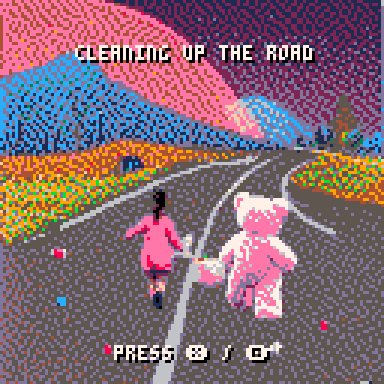
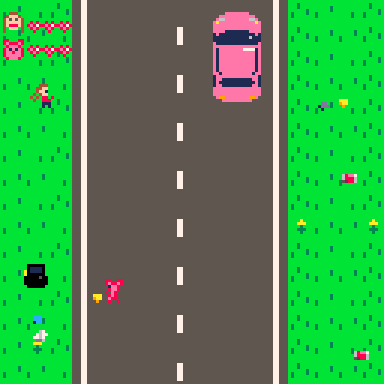
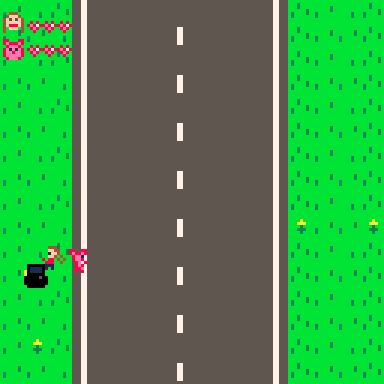

# Cleaning up the road
A simple, kid-friendly, 2-player PICO-8 game.

Inspired by other PICO-8 games made by parents with their children, I asked my young daughter if she wanted to make a game with me.  *"Yes!"*    
**"What should it be about?"**     *"We would be cleaning garbage off the road."*    
**"And what should we call it?"**     *"Cleaning up the road!"*    

This game is the eventual result after trying a bunch of ideas, testing, and tweaking.  It is not a hard game, appropriate for young kids to learn how controllers work.  With so many games being too difficult for preschool age, I erred on the side of simpler and easier.

_All that said, make sure your kids understand the dangers of roads._





## Ways to play:
PICO-8 cart file (also available on `splore`)


### Web versions:

https://thtroyer.github.io/cleaninguptheroad/

(todo: BBS link)


## Controls:

### PICO-8 controller:

```
D-pad to move

X to pick up

O to throw

Start for menu
```


### Keyboard

```
Player 1: Arrow keys = D-pad, X = Pickup/drop, Z = throw

Player 2: ESDF = D-pad, Q = Pickup/drop, W = throw

P/Enter key - console menu
```

## Menu options
Music can be toggled on/off and controls can be swapped for player 1 and 2.

## About
This is my first PICO-8 project and my first released video game.  Code is in Lua and the .p8 files are viewable as text, but the project is best viewed in the PICO-8 environment itself.


