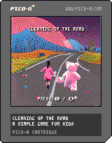

# Cleaning up the road
A simple PICO-8 game I'm creating with my daughter.

Play the web version here:
https://thtroyer.github.io/cleaninguptheroad/

##Controls:
###PICO-8 controller:

D-pad to move

X to pick up

O to throw

Start for options

###Keyboard
Player 1: Arrow keys = D-pad, X = Pickup/drop, Z = throw
Player 2: ESDF = D-pad, Q = Pickup/drop, W = throw
P/Enter key - console menu

## About
This is my first PICO-8 project.  Code is in Lua and the .p8 files are viewable as text, but the project is best viewed in the PICO-8 emulator/IDE itself.

The .p8 file in this repository will be the most up-to-date.  I'll try update the .p8.png cart below and web version semi-regularly as well.

## PICO-8 resources:
https://www.lexaloffle.com/pico-8.php

## Web version
A web-playable version is available here:  
